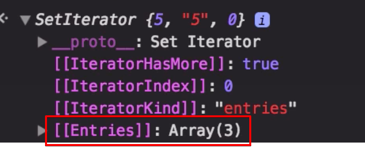
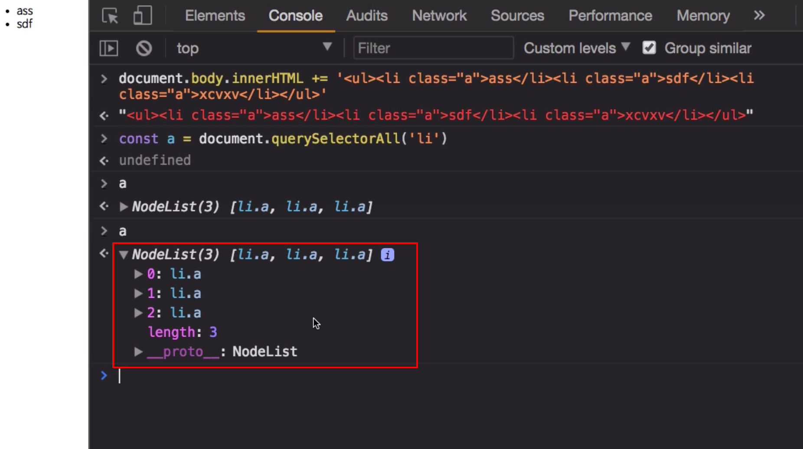

# 12. set, weakset

## 12-1. Set

### 12-1-1. 소개

```js
Array.prototype.pushUnique = value => {
  if(!this.includes(value)) {
    this.push(value)
  }
  return this
}
const arr = [1, 2, 3]
arr.pushUnique(5)
arr.pushUnique(4)
arr.pushUnique(3)
```

```js
const set = new Set([1, 2, 3])
set.add(5)
set.add(4)
set.add(3)
```

### 12-1-2. 상세

#### 실무에서의 활용영역

- 중복제거
- 전체순회할 필요성이 있는 자료구조(배열보다 빠름)
- 값의 유무 판단(배열보다 빠름, hash함수 구현)

####  사용하지 말아야 하는 경우

- 특정 요소의 접근
- 인덱스가 필요한 경우

#### 1. 중복이 허용되지 않으며 순서를 보장하는, 값들로만 이루어진 리스트

- 배열에서 5라는 요소를 찾기 위해서는 각 전체 배열 순회하며 찾아야 하지만

- Set의 경우 내부가 Hash 함수로 구현되어 빠름 

- 인덱스는 없지만 순서는 보장함 

- Entries라는 속성을 가지고 있으나 접근은 불가

  

#### 2. 추가, 삭제, 초기화, 요소의 총 개수, 포함여부확인

```js
const set = new Set()
set.add(5)
set.add('5')
set.add(-0) // - 값은 똑깥기 때문에
set.add(+0) // 0 은 하나만 존재

console.log(set.size)

console.log(set.has(5)) // 포함여부 조사
console.log(set.has(6))

set.delete(5) // set은 인덱스 개념이 아님 
console.log(set.has(5))

set.clear()
console.log(set.size)
console.log(set)


// 아래 3개가 똑같다. 
set.entries(); 
set.keys();
set.values();  
```

#### 3. 초기값 지정

인자로 iterable한 개체를 지정할 수 있다.

```js
// 초기값을 배열을 인자로 넣어 정해질 수 있음 
const set1 = new Set([1, 2, 3, 4, 5, 3, 4, 2])
console.log(set1)

const s = new Set([1,2,3,'1','3',2,5,6,'6',6 ])
const ss = new Set([...s]) // 배열만 펼칠 수 있는 것이 아니라 이터러블 한 모든 객체는 펼칠 수 있음

// 맵은(key, value) 형태의 새로운 자료형, 
// 키 값이 객체도 올 수 있고, 뭐든 올 수 있음
// 맵도 펼칠 수 있음, 이터러블한 객체라면 뭐든 올 수 있음 
// iterable Object: array, string, map, set 

const map = new Map()
map.set('a', 1).set('b', 2).set({}, 3)
const set2 = new Set(map)
console.log(set2)

const gen = function* () {
	for (let i = 0; i < 5; i++) {
		yield i+1
  }
}
const set = new Set(gen())
```

#### 4. 인덱스(키)가 없다!

```js
console.log(set.keys())
console.log(set.values())
console.log(set.entries())

// 모든 값이 다 똑같다. 
// key 와 value 가 똑같다. 
console.log(...set.keys())
console.log(...set.values())
console.log(...set.entries())

// set에도 forEach 가 있다. 
set.forEach(function(key, value, ownerSet) {
  console.log(key, value, this)
}, {})

// 인덱스 접근 불가 
// Set은 모든 자료를 순회하면서 처리해야 할때 쓰는 자료형 
// 아래처럼 하나의 값만 뽑아 쓸때는 부적합, 순회를 돌릴때 더 빨리 돌릴 수 있음 
console.log(set[1])
```

#### 5. 배열로 전환하기

```js
const set = new Set([1, 2, 3, 3, 4, 4, 5, 5, 1])
const arr = [...set]
console.log(arr)
```

#### 6. 중복 제거한 배열 만들기

```js
const makeUniqueArray = arr => [...new Set(arr)]
const arr = [1, 2, 3, 3, 4, 4, 5, 5, 1]

const newArr = makeUniqueArray(arr)
console.log(newArr)
```

## 12-2. WeakSet

#### 1. set과의 비교

- set에 객체를 저장할 경우 set에도 해당 객체에 대한 참조가 연결되어, 여타의 참조가 없어지더라도 set에는 객체가 여전히 살아있음.  
- 한편 WeakSet은 객체에 대한 **참조카운트를 올리지 않아, 여타의 참조가 없어질 경우 WeakSet 내의 객체는 G.C의 대상이 됨.**

#### 참조 카운트 개념

```js
// Weakeset
const s = new WeakSet() // 참조카운트를 증가시키지 않음

// 참조 카운트가 뭐지?
let o = {}; // 이 객체는 o 라는 메모리에 직접할당 되어있나? 아니다. 객체는 별도로 만들고 o에 주소값을 할당 
// 그래서 참조카운트는 ? o가 {} 요런 객체를 참조합니다. -> 참조카운트가 1이 되었어요.

let o2 = o; // o2도 {} 객체를 참조합니다. -> 참조카운트가 2가 되었어요.

let o2 = null // o2가 더 이상  {}객체를 참조하지 않네요. 참조카운트가 1이 되었어요. 

let o = null // o가 더 이상 {}객체를 참조하지 않네요. 참조카운트가 0이 되었어요. 

// 이제  {}는 아무도 참조 하지 않는 객체가 되었어요. -> Garbage Collector의 수거 대상이 되었어요.
```

- WeakSet은 참조 카운트를 올리지 않는다는 것을 증명하는 예제

```js
const obj1 = { a: 1 } // 참조카운트 1
const set = new Set()
set.add(obj1) // 참조 카운트 2 
obj1 = null  // 참조카운트 1 
```

```js
const obj2 = { b: 2 } // 참조카운트 1 
const wset = new WeakSet() 
wset.add(obj2) // 참조카운트를 증가시키지 않음, 참조카운트 여전히 1
obj2 = null // 참조카운트 0 -> G.C 의 수거대상이 됨, 언제가 G.C 되면, West에는 아무것도 담겨있지 않게됨

// 그렇다면 아래처럼 변수에 담아 변수를 넣지 않고 WeakSet초기화 당시에 넣으면 어떻게 될까요?
// 안정성이 떨어지니까 쓰지 않는다, 참조카운트가 0인 상태로 객체가 탄생되니까, 언제 G.C에 수거될지 모름
const s = new WeakSet({b:2}, {a;1});
```

#### 2. 참조형 데이터만 요소로 삼을 수 있다.

#### 3. iterable이 아니다.
- for ... of 사용 불가
- size 프로퍼티 없음
- `wset.keys()`, `wset.values()`, `wset.entries()` 등 사용 불가

#### 4. 활용사례는 아직까지는 많지 않다. 

- [use case of WeakSet](https://www.sitepoint.com/using-the-new-es6-collections-map-set-weakmap-weakset/) (알려진건 하나뿐..) 

```js
const isMarked = new WeakSet()
const attachedData = new WeakMap()

class Node {
  constructor (id) {
    this.id = id
  }
  mark () { isMarked.add(this) }
  unmark () { isMarked.delete(this) }
  set data (data) { attachedData.set(this, data) }
  get data () { return attachedData.get(this) }
}

let foo = new Node('foo')
foo.mark()
foo.data = 'bar'
console.log(foo.data)

isMarked.has(foo)
attachedData.has(foo)

foo = null

// G.C 수거해간 이후..
isMarked.has(foo) //false
attachedData.has(foo) //false 

```

### Dom Node의 실시간 반영을 위해 써보면 어떨까?



- li 3개를 만들어 놓고 이를 a에 담으면 a 변수는 유사배열객체로 3개의 li를 가지고 있음
- 그러나 li를 하나 지우고 다시 a 변수를 살펴도 a는 여전히 3개임 실시간으로 정보가 반영되지 않음
- 위크셋과 위크맵에 들어있다면, 어느 순간에 G.C 에 의해 사라지니까 실시간(완전 실시간은 아님)으로 해당 상태를 반영할 수 있음

