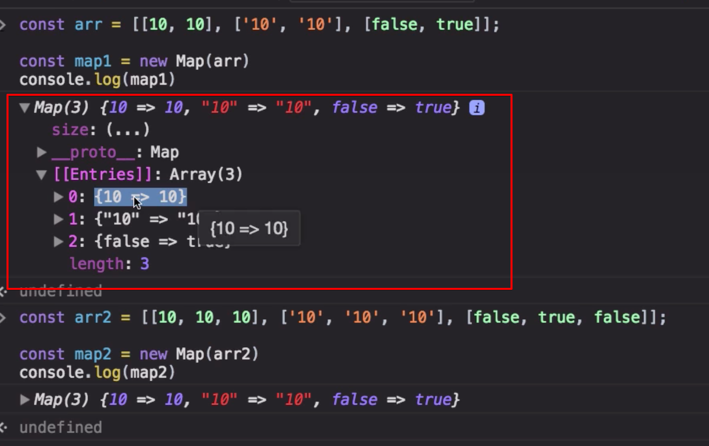
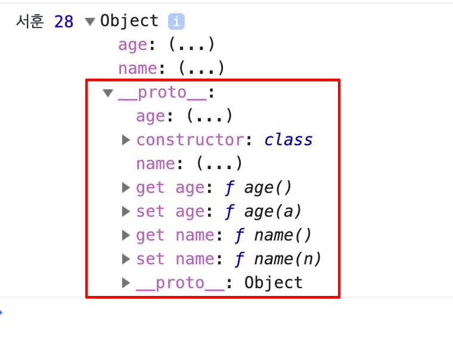

# 13. map, weakmap

## 13-1. Map

### 13-1-1. 객체의 단점

#### 1. iterable하지 않다.

- for in 문은 실제 iterable 하지 않다. 
- 마치 iterable 한 것 처럼 구현을 해놓은 것일 뿐이다.

```js
const o = { a: 1, b: 2, c: 3 }

// (1)
for (let key in o) {
  console.log(key, o[key])
}

// (2)
Object.prototype.method = function () { }
for (let key in o) {
  console.log(key, o[key])
} //method 까지 같이 출력, 고유의 프로퍼티인지, 프로토타입에 포함되어있는 프로퍼티인지 상관하지 않음


// (3) 위 문제를 해결하기 위해 아래 로직을 활용
for (let key in o) {
  if(o.hasOwnProperty(key)) {
    console.log(key, o[key])
  }
}

// (4) 배열로 전환하기 위해서는 아래 로직을 활용(손이 많이 감)
const obj2Arr = obj => {
  const arr = []
  for (let key in obj) {
    if(obj.hasOwnProperty(key)) {
      arr.push([key, obj[key]])
    }
  }
  return arr
}
const oArr = obj2Arr(o) 
oArr.forEach(v => console.log(v))

// (5) // 아래 방법으로도 배열로 전환한다.
const oArr2 = Object.keys(o).map(k => [k, o[k]])
oArr2.forEach(v => console.log(v))
```

#### 2. 키를 문자열로 취급한다.

```js
const obj = {
  1: 10,
  2: 20,
  3: 30
}
let res = 0
for (let key in obj) {
  res += key
}
console.log(res) // 0123 
```

#### 3. 따라서 키값의 unique함을 완벽히 보장하지 못함.

```js
const obj = {
  1: 10,
  01: 20,
  '01': 30
}
console.log(obj) //{1:10, 01:30) 01이 Cascading됨 

```

#### 4. 프로퍼티 개수를 직접 파악할 수 없다.

- length 프로퍼티가 없어서 뭔가 변환을 해야만 쓸 수 있음

```js
const obj = { a: 1, b: 2, c: 3 }
console.log(Object.keys(obj).length)
console.log(Object.values(obj).length)
```

### 13-1-2. Map 

#### 1. [ key, value ] 쌍(pair)으로 이루어진 요소들의 집합.



#### 2. 순서를 보장하며, iterable하다.

#### 3. 키에는 어떤 데이터타입도 저장할 수 있으며, 문자열로 취급하지 않는다.

```js
const map = new Map()
map.set(1, 10) // 숫자 1
map.set(01, 20) // 숫자 01 -> 1 
map.set('01', 30) // 문자 "01" 
// 이번에는 01 이 1을 덮어씌웠음, key가 문자가 아니라 숫자값을 포함한 모든 데이터타입이 들어갈 수 있기 때문

map.set({}, 40) // 배열도 key가 될 수 있음
map.set(function(){}, ()=>{}) // 함수도 key가 될 수 있음
console.log(map)
```

#### 4. 추가 / 값 가져오기 / 삭제 / 초기화 / 요소의 총 개수 / 포함여부확인

```js
const map = new Map()
map.set('name', '재남')
map.set('age', 30)

console.log(map.size)

console.log(map.get('name')) // 객체의 경우 map.name 임, 조희의 경우 객체보다 손이 많이감
console.log(map.get('age'))

map.delete('name')
console.log(map.has('name')) // true
console.log(map.has('age'))  // false
console.log(map.size) // 사이즈 가능

map.clear()
console.log(map.has('name'))
console.log(map.has('age'))
console.log(map.size)
```

#### 5. 초기값 지정  
인자로 iterable한 개체를 지정할 수 있다.

```js
const map1 = new Map([[10, 10], ['10', '10'], [false, true]]) // 2가지 원소(key, value)로 이루어진 배열이 들어감
// 3개씩 넣으면 마지막을 잘라서 반영 
[[10, 10, ture], ['10', '10', '11'], [false, true, tru]] // 이렇게 넣어도
[[10, 10], ['10', '10'], [false, true]] // 이렇게 잘림
console.log(map1)

const map2 = new Map(map1)
console.log(map2)
console.log(map1 === map2)

const gen = function* () {
	for (let i = 0; i < 5; i++) {
		yield [i, i+1]
  }
}
const map3 = new Map(gen())
console.log(map3)
```

#### 6. 기타 메소드 소개

```js
const map = new Map([[10, 10], ['10', '10'], [false, true], ['name', '재남']])
const mapKeys = map.keys() // Mapiterator 를 객체로 돌려줌,
const mapValues = map.values() // Mapiterator 를 객체로 돌려줌, next 를 메소드로 가짐 
const mapEntries = map.entries() // Mapiterator 를 객체로 돌려줌,

map.forEach(function(value, key, ownerMap) {
  console.log(`${key}: ${value}`)
  console.log('ownerMap: ', ownerMap, 'this: ', this)
}, [])
```

#### 7. 배열로 전환하기

```js
const map = new Map([[10, 10], ['10', '10'], [false, true], ['name', '재남']])
const mapArray1 = [...map] // [...map.entries()]과 같음
const mapArray2 = [...map.keys()]
const mapArray3 = [...map.values()]
const mapArray4 = [...map.entries()] // [...map]과 같음

// 근데 왜 Set에는 keys(), values(), entries() 가 똑같은데도 모두 존재하는 거야?
// map과 쌍을 맟추기 위해 그냥 만들어 놓은 거임

console.log(mapArray1, mapArray2, mapArray3, mapArray4)

// 다만 객체는 이야기가 좀 다름
// es5에서 만들어졌을때는 iterable이라는 개념이 없었음, 그래서 그냥 배열로 준 것임
const obj = {a:1, b:2, c:3}
Object.keys(obj) // ["a", "b", "c"] 배열로 줌, 
Object.values(obj) // [1, 2, 3]  배열로 줌,
Object.entries(obj) // [Array(2), Array(2), Array(2)]
Object.entries(obj).next() // Uncaught TypeEroor, Object.entries().next not a fucntion 
// 이터러블이 아니기 때문에 next() 활용 못함 

```

#### 8. 객체로 전환하기

```js
const map1 = new Map([[10, 10], ['10', '10'], [false, true], ['name', '재남']])
const map2 = new Map([[{}, 10], [function(){}, '10'], [[], true], [Symbol('심볼'), '재남']])
const convertMapToObject = map => {
  const resultObj = {}
  [...map].forEach(([k, v]) => {
    if(typeof k !== 'object') {
      resultObj[k] = v
    }
  })
  return resultObj
}
const obj1 = convertMapToObject(map1)
const obj2 = convertMapToObject(map2)
```

## 13-2. WeakMap

#### 1. Map과의 비교  
- Map에 객체를 키로 하는 데이터를 추가할 경우 Map에도 해당 객체에 대한 참조가 연결되어, 여타의 참조가 없어지더라도 Map에는 객체가 여전히 살아있음.  
- 한편 WeakMap은 객체에 대한 참조카운트를 올리지 않아 (약한 참조), 여타의 참조가 없어질 경우 WeakMap 내의 객체는 G.C의 대상이 됨.

```js
const obj1 = { a: 1 }  // 참조카운터 1
const map = new Map()
map.set(obj1, 10) // 참조카운터 2
obj1 = null // 참조카운터 1

const obj2 = { b: 2 } // 참조카운터 1
const wmap = new WeakMap()
wmap.set(obj2, 20) 
obj2 = null // 참조 카운트가 0이 되어 G.C의 대상이 됨 
```

#### 2. 참조형 데이터만 키로 설정할 수 있다.

- value는 상관없고 key에 참조형 데이터가 와야 한다. 

```js
const keysArray = [{a: 1}, [1, 2, 3], function(){}, Symbol('키'), 45, '문자열', false]
const wmap = new WeakMap()
keysArray.forEach((v, i) => {
  wmap.set(v, i)
  console.log(wmap.get(v))
})

// Symbol('키') 는 Invalid value 이므로 WeakMap key로 사용할 수 없음
// '문자열' 도 마찬가지 

```

#### 3. iterable하지 않다.

- for ... of 사용 불가
- size 프로퍼티 없음
- `keys()`, `values()`, `entries()`, `clear()` 등 사용 불가

#### 4. 활용사례

- 비공개 객체 멤버

```js
// Object.assign(target, ...sources) 객체 복사하는 메소드, 
// target 에 sources 에 있는 프로퍼티가 있으면 sources의 값으로 덮어씀
// 그래서 아래 메소드는 기존에 key로 WeakmapValuaAdder에서 인스턴스를 찾아와서
// 변경사항을 수정한 새 객체를 만들고 다시 새 객체로 갈아끼움
// 그럼 기존(변경 이전에 WeakMap에 담겨있는 객체) 객체는 G.C의 대상이 되어 언젠가 사라짐 
const weakmapValueAdder = (wmap, key, addValue) => {
  wmap.set(key, Object.assign({}, wmap.get(key), addValue))
}
const Person = (() => {
  const privateMembers = new WeakMap()
  return class {
    constructor(n, a) {
      privateMembers.set(this, { name: n, age: a }) 
  
    }
    set name (n) {
      weakmapValueAdder(privateMembers, this, { name: n })
    }
    get name () {
      return privateMembers.get(this).name
    }
    set age (a) {
      weakmapValueAdder(privateMembers, this, { age: a })
    }
    get age () {
      return privateMembers.get(this).age
    }
  }
})()
const jn = new Person('재남', 30)
console.log(jn.name, jn.age, jn)

jn.age = 25
console.log(jn.name, jn.age, jn)

const sh = new Person('서훈', 28)
console.log(sh.name, sh.age, sh)

sh.name = '성후'
console.log(sh.name, sh.age, sh)
```


-  `new Person('재남', 30)`  빈객체를 리턴함, `this.name = ... , this.age =...`  가 없기 때문
- jn 을 조회해보면 age, name이 왜 있을까?  getter, setter 설정을 해놨기 때문
- console 객체가 디버깅 하는 사용자에게 편의를 제공하기 위해 보여주는 것일 뿐 실제는 빈 객체이고, 프로토타입 메서드로 getter, setter 함수를 가짐  



- 그래서 invoke 해야 해당 값이 출력됨 

# TODO: 온라인에는 삭제하고 올리기.

- DOM Element Event 관리

```js
const domInformations = new WeakMap()
const eventMap = new WeakMap()

document.body.innerHTML = `
<div id="a">클릭하세요 A</div>
<div id="b">클릭하세요 B</div>
<div id="c">클릭하세요 C</div>`.trim()

let elemA = document.getElementById('a')
let elemB = document.getElementById('b')
let elemC = document.getElementById('c')

domInformations.set(elemA, {clicked: 0})
domInformations.set(elemB, {clicked: 0})
domInformations.set(elemC, {clicked: 0})

const addEventListener = (elem, evt, listener, isCapture) => {
	elem.addEventListener(evt, listener, isCapture)
	if(!eventMap.has(elem)) {
    eventMap.set(elem, new Map())
  }
	const evtElem = eventMap.get(elem)
  evtElem.set(evt, listener)
	eventMap.set(elem, evtElem)
}

const removeEventListener = (elem, evt) => {
	const targetElem = eventMap.get(elem)
	const listener = targetElem.get(evt)
  elem.removeEventListener(evt, listener)
	// targetElem.delete(evt)
	if(!targetElem.size) {
		eventMap.delete(elem)
  }
}

const elemListener = (elem, evt, willRemoveCallback) => function () {
  let elemData = domInformations.get(elem)
  elemData.clicked++
  domInformations.set(elem, elemData)
  console.log(`${elem.id}: ${elemData.clicked}번 클릭하셨습니다.`)

  if(elemData.clicked >= 5) {
    removeEventListener(elem, evt)
    willRemoveCallback(elem)
  }
}

addEventListener(elemA, 'click', elemListener(elemA, 'click', () => {
  elemA = null
}))
addEventListener(elemB, 'click', elemListener(elemB, 'click', () => {
  elemB.remove()
}))
addEventListener(elemC, 'click', elemListener(elemC, 'click', () => {
  elemC.remove()
	elemC = null
}))
```
