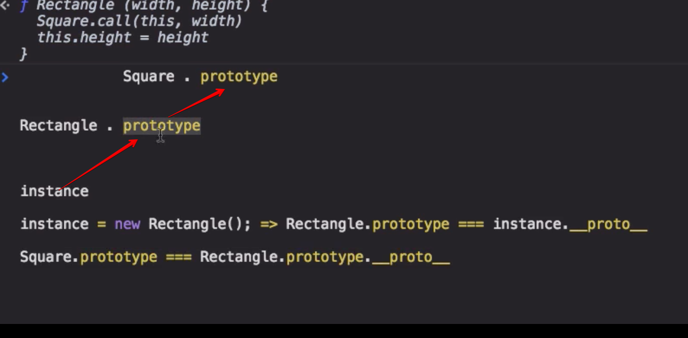

# 15. Class


## 15-1. 소개

[클래스 - ES5와의 비교 관련 블로그 링크](https://gomugom.github.io/is-class-only-a-syntactic-sugar/)

```js
function Person1 (name) {
  this.name = name
}
Person1.prototype.getName = function () {
  return this.name
}
Person1.isPerson = function (obj) {
  return obj instanceof this
}
const jn1 = new Person1('재남')
console.log(jn1.getName())
console.log(Person1.isPerson(jn1))

class Person2 {
  constructor (name) { this.name = name }
  getName () { return this.name }
  static isPerson (obj) { return obj instanceof this }
}
const jn2 = new Person2('재남2')
console.log(jn2.getName())
console.log(Person2.isPerson(jn2))
```

## 15-2. 상세

#### 1) 선언방식

```js
// 클래스 리터럴
class Person1 { }
console.log(Person1.name)

// 기명 클래스 표현식
const Person2 = class Person22 { }
console.log(Person2.name)

// 익명 클래스 표현식
let Person3 = class { }
console.log(Person3.name)
```

#### 2) 기존 방식과의 차이점

- let, const와 마찬가지로 TDZ가 존재하며, 블록스코프에 갇힌다.

```js
if(true) {
  class A { }
  const a = new A()
  if(true) {
    const b = new A() // TDZ
    class A { }
  }
}
const c = new A() //Reference Error
```

- class 내부는 strict mode가 강제된다.

- 모든 메소드를 열거할 수 없다. (콘솔에서 색상이 흐리게 표기됨)

```js
class A {
  a () { }
  b () { }
  static c () { }
}

for (let p in A.prototype) {
  console.log(p)
}

A.prototype.a = function () { }
A.prototype.d = function () { }

for (let p in A.prototype) {
  console.log(p)
}
```

- constructor를 제외한 모든 메소드는 `new` 명령어로 호출할 수 없다.
  - 기존 프로토타입 방식에서는 함수 선언을 그대로 썻음 
  - 기존 함수는 함수로서의 역할과 생성자로서의 역할을 모두 가지고 있었음 
  - class 를 통해 생성된 객체의 메소드는 기존 함수의 무거움(prototype) 객체를 버렸다.

```js
class A {
  constructor () { }
  a () { }
  static b () { }
}
const a = new A.prototype.constructor()
const b = new A.prototype.a()
const c = new A.prototype.b()

const d = new A()
const e = new d.constructor()
```

- 생성자로서만 동작한다.

```js
class A { }
A() // Unacaught TypeError Class constructor A cannot be invoked without 'new' 

// 예전에 썻던 기법
new.target === undefined 
```

- 클래스 내부에서 클래스명 수정

```js
let A = class {
  constructor () { A = 'A' } // 
}
const a = new A()
console.log(A) // "A"

const B = class {
  constructor () { B = 'B' }
}
const b = new B()

// A와 비교 
// 밑에 코드가 되면 이것은 let으로 선언한 것과 비슷, 재할당이 가능하니까 
// 안되면 const 로 선언한 것과 비슷, 재할당이 불가능하니까
class C {
  constructor () { C = 'C' }
}
const c = new C() // Assignment to constant variable 
// 결국 내부에서 C를 할당할 때는 상수 로직으로 작동.

// 밖에서는 할당이 됨 
c = "10" 

function a () { a = 'a' }
```

- 클래스 외부에서 클래스명 수정

```js
let A = class { }
A = 10;             // ok

const B = class { }
B = 10;             // Uncaught Type Error: Assignment to constant variable

class C { }
C = 10;             // ok  
```

- 외부에서 prototype을 다른 객체로 덮어씌울 수 없다 (읽기전용)

```js
class A {
  a () { }
}

// prototype 객체는 읽기 전용 이다. 할당해도 안됨 
A.prototype = {
  a () { console.log(1) }
}

// 메소드 하나하나를 바꿔치기 하는 것은 가능, 아직까지는 
const a = new A()
a.a()
```

#### 3) '문'이 아닌 '식'이다.

- 식은 연산 후 곧 값으로 평가됨 
- 값은 할당 가능 &rarr;  class 를 함수에 인자로 전달 가능 

```js

const jn = new class {
  constructor (name) { this.name = name }
  sayName () { console.log(this.name) }
}('재님')
jn.sayName()
```

```js
// 클래스를 인자로 전달하기 
const instanceGenerator = (className, ...params) => new className(...params)
class Person {
  constructor (name) { this.name = name }
  sayName () { console.log(this.name) }
}
// new 없이 함수로 인스터스를 만들 수 있음
const jn = instanceGenerator(Person, '재나')

// 익명클래스를 함수의 인자로 전달
const sh = instanceGenerator(class {
  constructor (name) { this.name = name }
  sayName () { console.log(this.name) }
}, '성후')

jn.sayName()
sh.sayName()

// 값이기 때문에 가능해지는 이상한 일들 

// 원래는 
class C {}
class B extends C {}
class A extends B {}

// 위를 요상하게 바꿔버리기
class A extends class extends class {} {} {}   //최상위 // 중간 //최하위 클래스
```

#### 4) 접근자

```js
class CustomHTMLElement {
  constructor (element) {
    this._element = element
  }
  get html () {
    return this._element.innerHTML
  }
  set html (value) {
    this._element.innerHTML = value
  }
}

// getter, setter 는 enumerable 하기 때문에 열거대상이 아니라 아무것도 안나옴
console.log(Object.entries(CustomHTMLElement.prototype)

// 열거대상에 제외대는 대상에 접근하기 위해서는?
console.log(Object.getOwnPropertyDescriptor(CustomHTMLElement.prototype, 'html'))
```

#### 5) computed property names

- 변수명이 바뀌어도 호출이 가능하도록 대괄호 표기법 사용 가능 
- 계산된 이름 표기법

```js
const method1 = 'sayName'
const fullNameGetter = 'fullname'
class Person {
  constructor (name) { this.name = name }
  [method1] () { console.log(this.name) }
  get [fullNameGetter] () { return this.name + ' 정' }
}
const jn = new Person('재나')
jn.sayName()
console.log(jn.fullname)
```

#### 6) 제너레이터

- class 내부에서도 generator 메소드로 사용가능

```js
class A {
  *generator () {
    yield 1
    yield 2
  }
}
const a = new A()
const iter = a.generator()
console.log(...iter)
```

#### 7) Symbol.iterator

- 객체와 똑같이 사용 가능 

```js
class Products {
  constructor () {
    this.items = new Set()
  }
  addItem (name) {
    this.items.add(name)
  }
  [Symbol.iterator] () {
    let count = 0
	  const items = [...this.items]
    return {
      next () {
        return {
          done: count >= items.length,
          value: items[count++]
        }
      }
    }
  }
}

const prods = new Products()
prods.addItem('사과')
prods.addItem('배')
prods.addItem('포도')

// 내부에 iterator 인터페이스를 구현했기 때문에 iterable 함 
// 그래서 for of, ... , 혜체할당 모두 가능 
for (let x of prods) {
  console.log(x)
}
```

```js
class Products {
  constructor () {
    this.items = new Set()
  }
  addItem (name) {
    this.items.add(name)
  }
  *[Symbol.iterator] () {
    yield* this.items
  }
}
const prods = new Products()
prods.addItem('사과')
prods.addItem('배')
prods.addItem('포도')
for (let x of prods) {
  console.log(x)
}
```

### 8) 정적 메소드 (static method)

```js
class Person {
  static create (name) {
    return new this(name)
  }
  constructor (name) {
    this.name = name
  }
}
const jn = Person.create('재난')
console.log(jn)
```

## 15-3. 클래스 상속

### 15-3-1. 소개

- 사각형 &rarr; 직사각형 &rarr; 직사각형 
- 변 4개 + 각이 90도 + 변길이 모두 같음

```js
// 보다 구체적일 수록 필요한게 적어짐

class 사각형 {
  constructor(a, b, c, d) {}
}

class 직사각형 {
  constructor(가로, 세로) {}
}

class 직사각형 {
  constructor(가로) {}
}


function Square (width) {
  this.width = width
}


Square.prototype.getArea = function () {
  return this.width * (this.height || this.width) //높이가 없으면  너비를 높이로 써라
}

// Rectangle 은 Square를 상속받아서 사용하고 싶다.
function Rectangle (width, height) {
  Square.call(this, width)
  this.height = height
}

// 클래스 상속을 흉내내기 위해 필요한 과정
// 원래는 상속과정에서 프로토타입 객체에 상위클래스의 프로퍼티가 보여서 이것도 지워야하고 
// constructor가 날아가니까 그것도 제대로 바꿔줘야 함
// 아래가 그것에 대한 내용임
function F() { }

F.prototype = Square.prototype
Rectangle.prototype = new F()
Rectangle.prototype.constructor = Rectangle

const square = Square(3)
const rect = new Rectangle(3, 4)

console.log(rect.getArea())
console.log(rect instanceof Rectangle)
console.log(rect instanceof Square)
```


```js
// 이제 상속은 아래와 깥이 쓰면 끝

class Square {
  constructor (width) {
    this.width = width
  }
  getArea () {
    return this.width * (this.height || this.width)
  }
}

// 예전 프로토타입 체이닝에서 접근자로 작동하는 super()가 변했어요
class Rectangle extends Square {
  constructor (width, height) {
    super(width) // 상위 클래스의 constructor를 호출하는 함수, 오직 생성자 안에서만 호출 가능
    // this.width = width 가 위의 super로 인해 가능해짐
    this.height = height
  }
}


const rect = new Rectangle(3, 4)
console.log(rect.getArea())
console.log(rect instanceof Rectangle)
console.log(rect instanceof Square)

// 왜 되는거야?
rect(__proto__) === Rectangle.prototype 
rect(__proto__).(__proto__) === Square.prototype
rect(__proto__).(__proto__).getArea(); // 호출가능
rect.getArea() //(__proto__).(__proto__); 생략가능
```

### 15-3-2. 상세

1. `class [서브클래스명] extends [수퍼클래스명] { [서브클래스 본문] }`

- 반드시 변수만 와야 하는 것이 아니라, 클래스 식이 와도 된다.
```js
class Employee extends class Person {
  constructor (name) { this.name = name }
} {
  constructor (name, position) {
    super(name)
    this.position = position
  }
}
const jn = new Employee('잰남', 'worker')
```

```js
class Employee extends class {
  constructor (name) { this.name = name }
} {
  constructor (name, position) {
    super(name)
    this.position = position
  }
}
const jn = new Employee('잰남', 'worker')
console.log(jn.__proto__.__proto__.constructor.name)
```

- 함수도 상속 가능.

```js
function Person (name) { this.name = name }
class Employee extends Person {
  constructor (name, position) {
    super(name)
    this.position = position
  }
}
const jn = new Employee('잰남', 'worker')
```

```js
class Employee extends function (name) { this.name = name } {
  constructor (name, position) {
    super(name)
    this.position = position
  }
}
const jn = new Employee('잰남', 'worker')
```

- 내장 타입 상속 가능

```js
// 내장 타입을 상속받아서 커스텀하게 쓸 수 있음 
// 원래 있던 고유 함수를 만드는 방법으로 자주 쓰임 
class NewArray extends Array {
  toString () {
    return `[${super.toString()}]`
  }
}
const arr = new NewArray(1, 2, 3)
console.log(arr)
console.log(arr.toString())
```

2. super (내부키워드로써, 허용된 동작 외엔 활용 불가)

- (1) constructor 내부에서
  - 수퍼클래스의 constructor를 호출하는 함수 개념.
  - 서브클래스의 constructor 내부에서 `this`에 접근하려 할 때는 **가장 먼저** super함수를 호출해야만 한다.
  - 서브클래스에서 constructor를 사용하지 않는다면 무관. (이 경우 상위클래스의 constructor만 실행된다.)거나, 내부에서 `this`에 접근하지 않는다면 무관.

- (2) - 메소드 내부에서
  - 수퍼클래스의 프로토타입 객체 개념.
  - 메소드 오버라이드 또는 상위 메소드 호출 목적으로 활용.

```js
class Rectangle {
  constructor (width, height) {
    this.width = width
    this.height = height
  }
  getArea () {
    return this.width * this.height
  }
}
class Square extends Rectangle {
  constructor (width) {
    console.log(super) // 접근 안됨
    super(width, width)
  }
  // 상위 메소드 덮어쓰기 위해 자주 사용됨
  getArea () {
    console.log('get area of square.')
    console.dir(super)  //메소드 안에서는 상위클래스에 접근하기 위한 super가 됨
    return super.getArea()  // getArea 함수 내부에서의 this는 여전히 자기 자신이 됨 
  }
}
const square = new Square(3)
console.log(square.getArea())
```

3. `new.target`을 활용한 abstract class 흉내

```js
// 추상 클래스를 만들어 new keword로 만들기 힘들게 만들어버림
class Shape {
  constructor () {
    if(new.target === Shape) {
      throw new Error('이 클래스는 직접 인스턴스화할 수 없는 추상클래스입니다.')
    }
  }
  getSize () {}
}
class Rectangle extends Shape {
  constructor (width, height) {
    super()
    this.width = width
    this.height = height
  }
  getSize () {
    return this.width * this.height
  }
}
const s = new Shape() // 에러 
const r = new Rectangle(4, 5)
```

## ㅅ